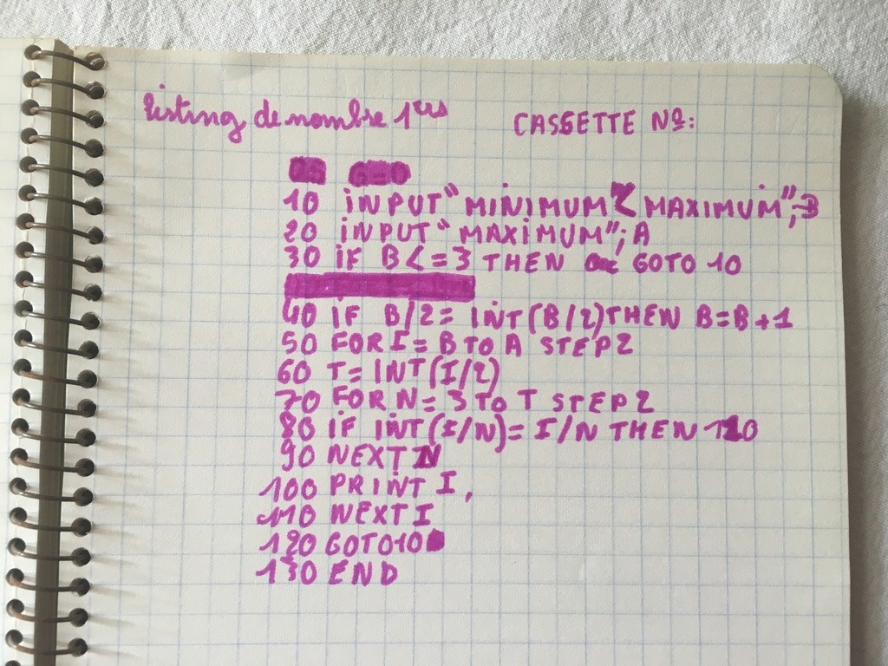

# Calcul de nombres premiers

Ecrit par Christian Quest, 1981

- premier.cas : fichier "cassette" pour l'émulateur xtrs
- premier.bas : fichier texte du programme BASIC
- premier.jpg : original du listing en photo ;)

